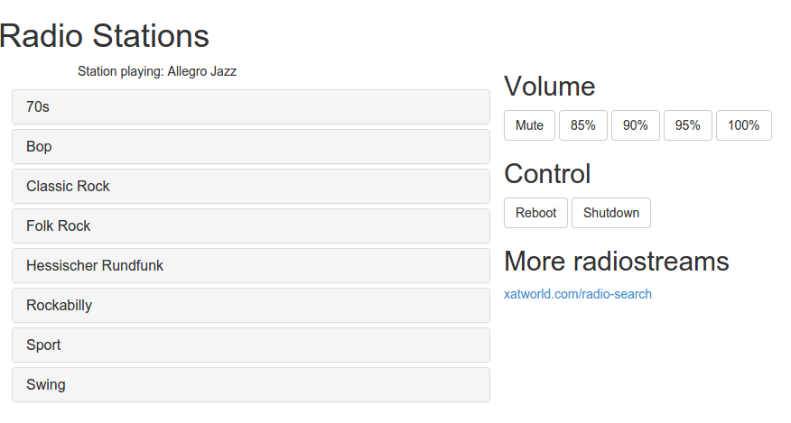
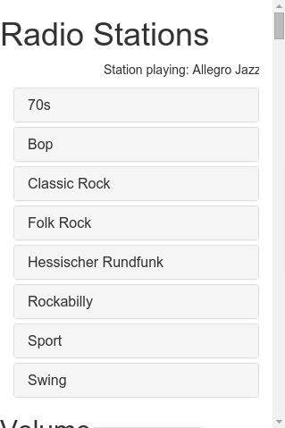

#FMBerryRemote

##What is this?

###What is FMBerry?
As written on its [project page](https://github.com/Manawyrm/FMBerry),
 "FMBerry is a piece of software that allows you to transmit FM radio with your Raspberry Pi."

For further information what FMBerry is and how to build one, please refer to the [FMBerry](https://github.com/Manawyrm/FMBerry)
project homepage.

###What is FMBerryRemote?
FMBerryRemote is a piece of software that allows you to control your FMBerry via a browser. FMBerryRemote provides
a responsive webinterface that can be used with every browser on desktop pc and mobiles like tablets and mobile phones.

FMBerryRemote allows you to change the webradio that is transmitted via your FMBerry by choosing stations via the webinterface.
Furthermore FMBerryRemote gives you the chance to set the volume of the FMBerry.

##Requirements
* Python 2.7
* mplayer
* Flask
* Flask-Bootstrap
* FMBerry software installed

##Installation
For installing FMBerryRemote, use the makefile contained in this repository:

    sudo make install

This will install all requirements (if not already installed) and to copy the needed shellscripts to systempath.

###Autostart FMBerry and FMBerryRemote
If you want FMBerry and FMBerryRemote to run at startup, add the following lines to file /etc/rclocal.
FMBerryRemote will be available via browser under the IP-address of the FMBerry device.

(Note that you've got to adjust the path to the the directory where you downloaded FMBerryRemote to.)

    (sleep 2; sudo /home/pi/fmberryremote/fmberrystart)&
    (sleep 2; sudo python /home/pi/fmberryremote/server/fmberryremote.py)&

#TODOs
* Replace mplayer with mpd
* When user changes settings (radio channel, volume, ...) save it persisantely and load last settings when server
  is shutdown and started again.